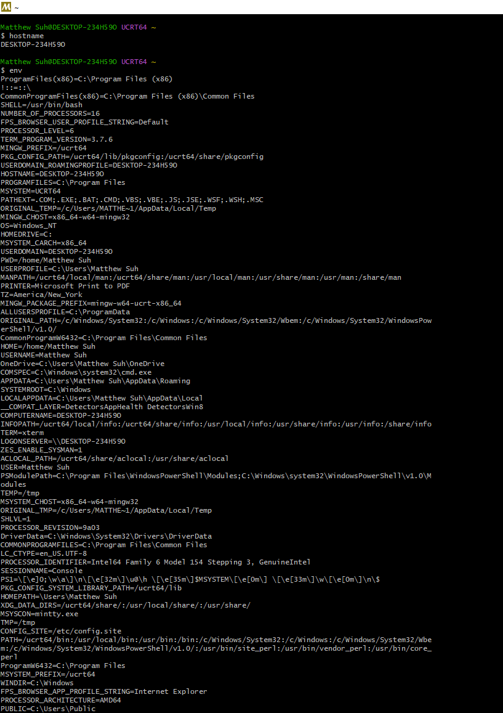
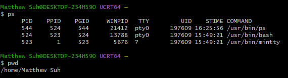
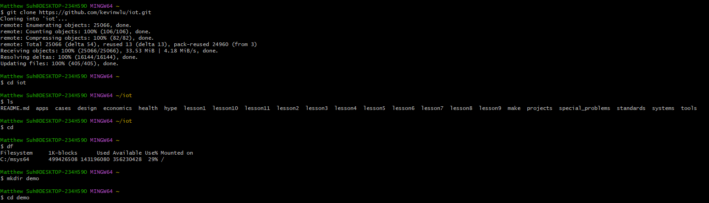
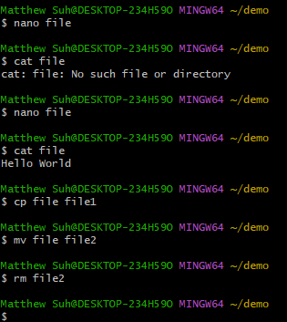
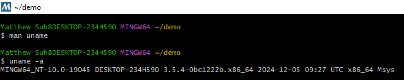
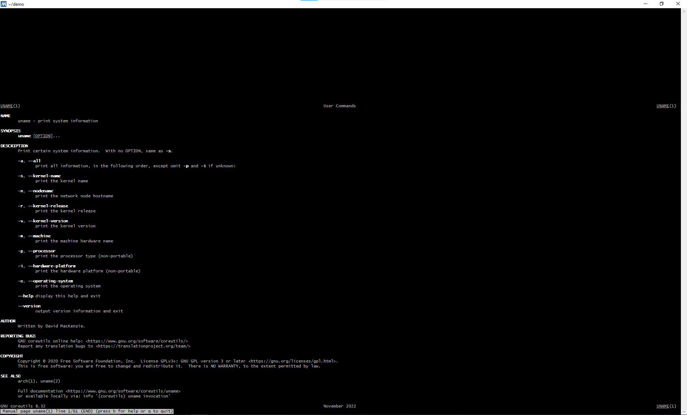
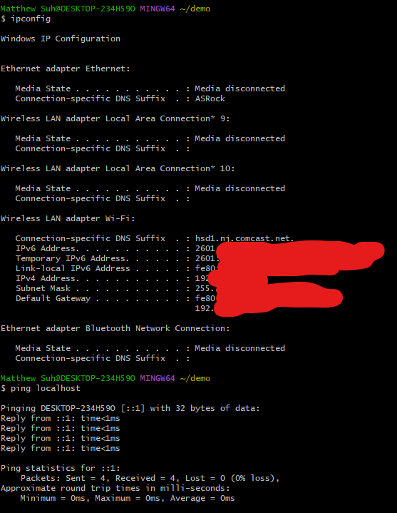
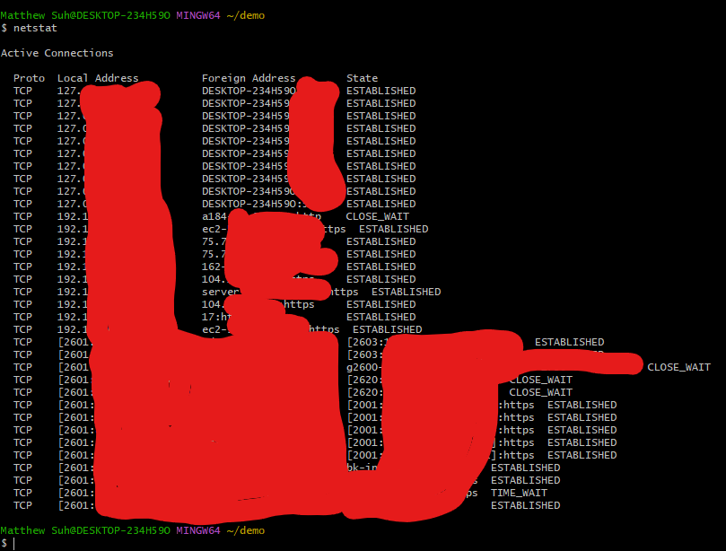

# Lab 2 - Command Line

### `hostname` & `env`

---
### `ps` & `pwd`

---
### `git clone`, `cd iot`, `ls`, `cd`, `df`, `mkdir demo`, `cd demo`

---
### `nano file`, `cat file`, `cp file file1`, `mv file file2`, `rm file2`

---
### `clear`, `man uname`, `uname -a`

---
### `man uname` output

---
### `ipconfig` & `ping localhost`

---
### `netstat`

