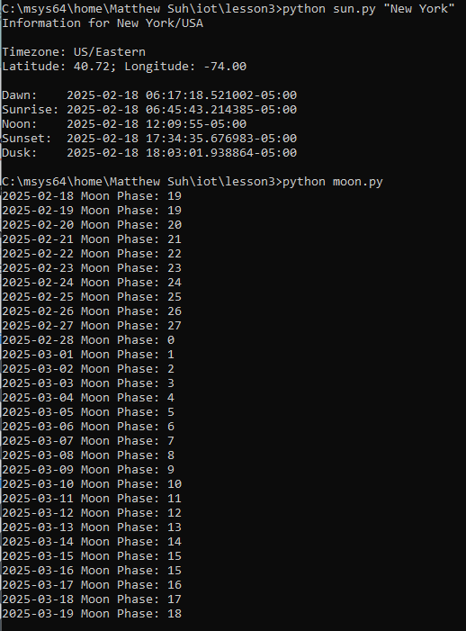
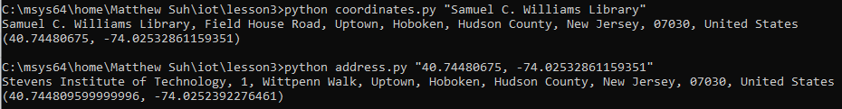
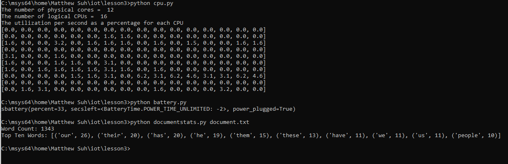

# Lab 3 - Python

### `cd ~/iot`, `cd *3`, `python3 julian.py`, `python3 date_example.py`

---
### `python3 datetime_example.py` & `python3 time_example.py`

---
### `python3 sun.py "New York"` & `python3 moon.py`

---
### `python3 coordinates.py "Samuel C. Williams Library"` & `python3 address.py "40.74480675, -74.02532861159351"`

---
### `python3 cpu.py`, `python3 battery.py`, `python3 documentstats.py document.txt`

---

