# Lab 4 - Django and Flask

# Django

### Installation
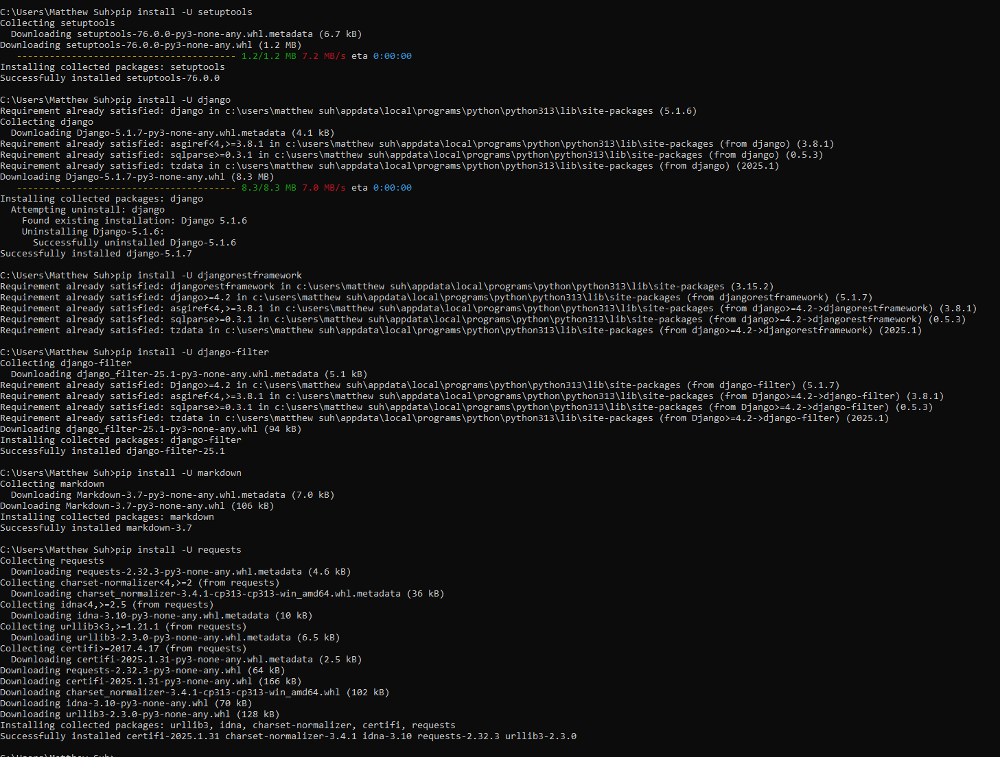
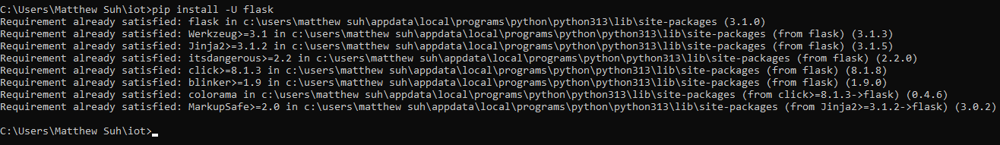
---
### Setting up Django project "Stevens"
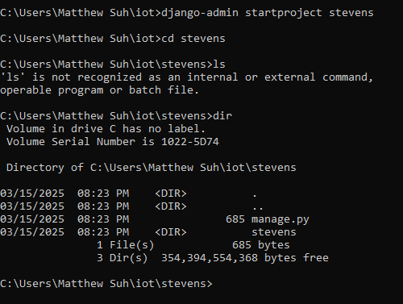
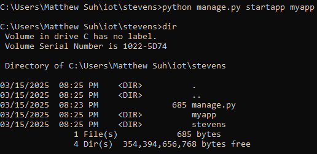
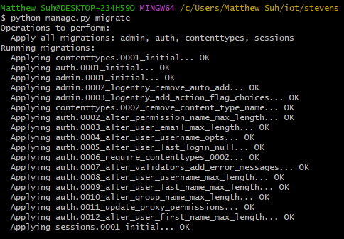
---
### Copying files
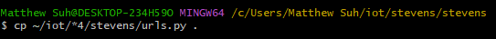
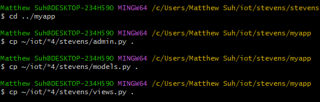

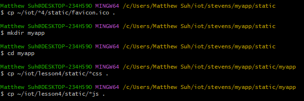
---
### Starting Server
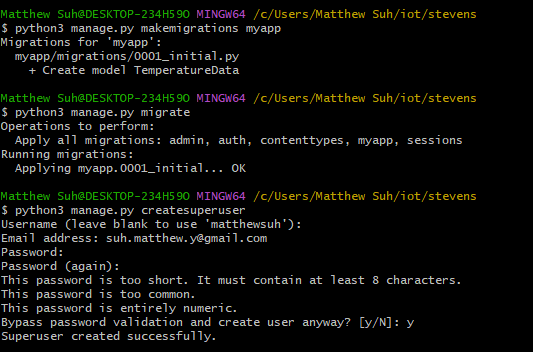
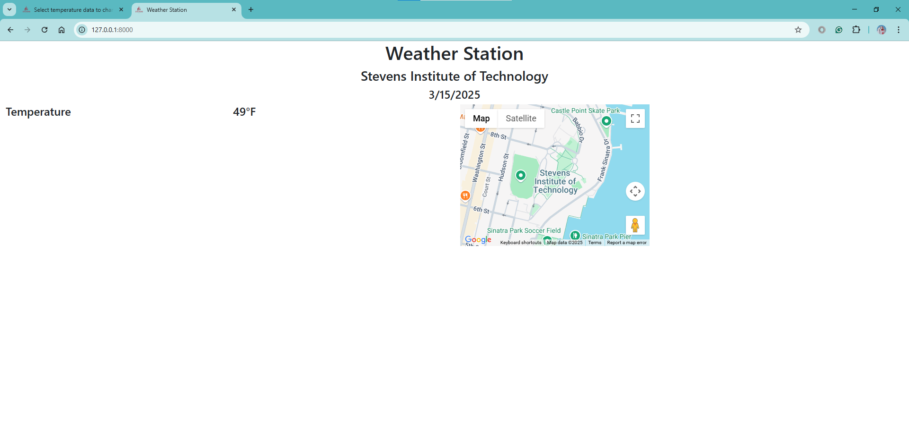
---

# Django REST

### Setting up Django REST project "mycpu"
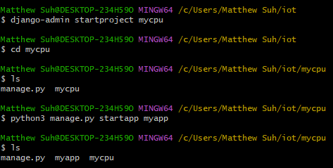
---
### Copying files
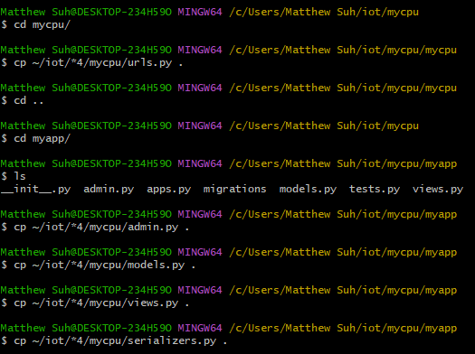
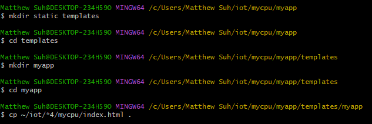
---
### Starting Server
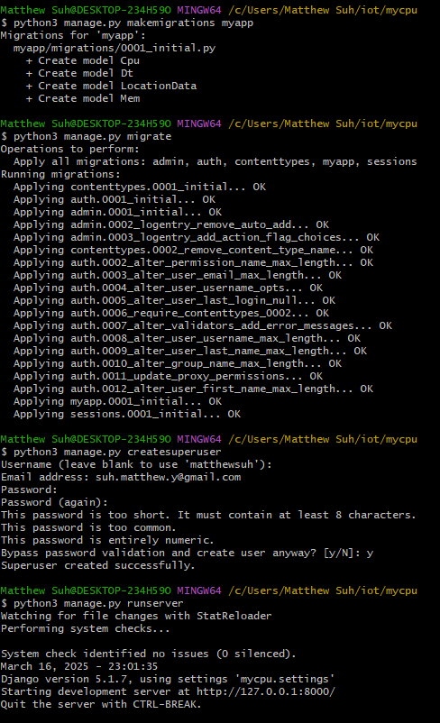
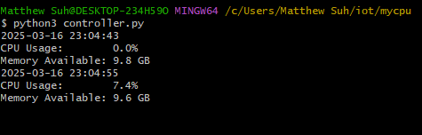
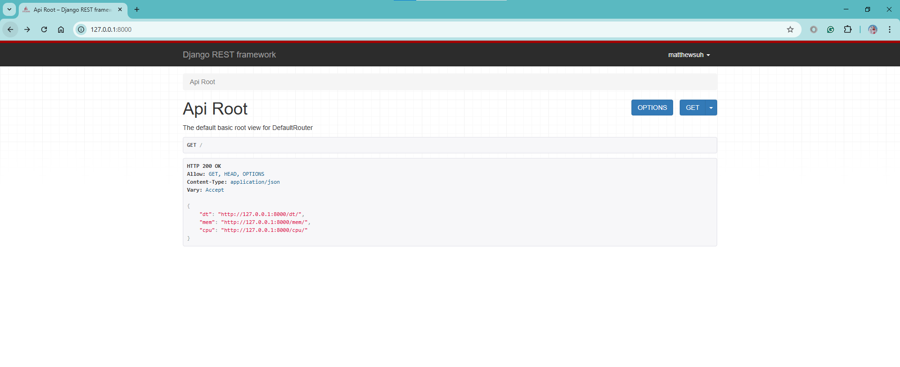
---

# Flask

### Starting server
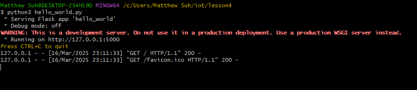
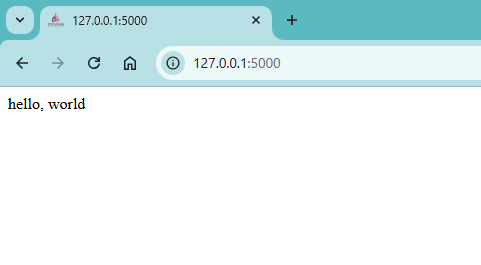
---
